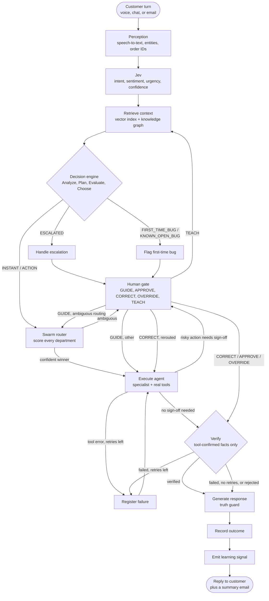

<div align="center">


<br/>

# Resolvyn

### The AI support team that resolves issues, not just answers questions.

> Talk to it. Chat with it. Email it.
> It finds the order, fixes the problem, proves it worked, and brings in a human exactly when one is needed.

<br/>


</div>

---

## What Resolvyn Is

Most support bots read you a help article. Resolvyn does the work.

A customer says "I was charged twice for my earbuds." Resolvyn identifies them, finds the order, spots the duplicate charge made 38 seconds after the first, checks the refund policy, asks a manager to approve the refund, executes it, verifies it with the refund service, and only then tells the customer it is done — by voice, chat, or email — followed by a written summary.

Every step is visible to the team in real time. Every risky action has a human gate. Every problem the AI has never seen goes to a person who teaches it, so the next customer gets the answer instantly from memory.

It runs on a laptop. The live conversation uses a 4-billion-parameter Qwen model fully on a 4 GB GPU — customer data never leaves the machine unless a cloud model is explicitly configured.

---

## Selling Points

### It Resolves, and Proves It

Other support systems say "done" as soon as the model says it. Resolvyn's reply pipeline blocks any claim not backed by a tool response — "your refund is processed" is only spoken after the refund service returns a confirmed reference. Agents run real tools (orders, payments, refunds, account unlock); nothing is claimed until a completed tool call has verified it.

### A Truth Guard Between the Model and the Customer

Language models hallucinate. Every sentence Resolvyn is about to say is filtered before it reaches the customer: unverified claims ("already reported by other customers"), invented dates, and made-up reference numbers are detected and removed before the voice or text reply is sent. Blocked sentences are counted and visible on the team console in real time.

### Jev — the Judgment Layer

Every caller utterance is scored in roughly 13 ms by Jev, a deterministic, rule-based judgment layer that runs ahead of the language model. It decides intent, department, sentiment, urgency, whether the caller wants a human, and simple dialogue acts (yes/no/done) — all before any model call, so the agent can start responding immediately even on modest hardware.

Jev's confidence score is not a guess; it is computed from the actual keyword competition between intents:

```
top_score, second_score = the two highest-scoring intents against app.domain.INTENTS

margin      = (top_score - second_score) / top_score
confidence  = min(95, 52 + 9 * min(top_score, 4) + 14 * margin)
```

capped at 66 when the winning intent matched on nothing more than a single generic word. If confidence still sits below 72 on a long-enough, not-carried-over utterance, Jev asks the fast local tier a single constrained-JSON question to settle it — a call that never blocks the conversation if it times out.

### The Swarm Router — Mixture-of-Experts Department Routing

Deciding *which* specialist should take a ticket is its own scored competition, not an `if/elif` chain. Every department (Technical, Billing, Account, Order, Other) evaluates the same ticket independently and produces an activation score in [0, 1]:

```
activation = 0.50 * intent_match          (phrase match against app.domain.INTENTS)
           + 0.20 * domain_match          (word match against app.domain.DEPARTMENT_KEYWORDS)
           + 0.15 * availability_factor   (1.0 idle, 0.6 already busy on another ticket)
           + 0.15 * historical_signal     (0.5 neutral by default; shifts as humans correct routing)
```

All five departments are scored from tables already in the codebase — no per-request model call, so scoring five candidates costs about the same as scoring one. The candidates are ranked and only the winner's specialist agent ever runs; the other four are suppressed, never executed. Routing is flagged **ambiguous**, instead of guessed at, when the winner's own score is below 0.20 or its lead over the runner-up is below 0.15 — in that case the ticket pauses at the same human gate every other uncertain step uses, a teammate resolves it with GUIDE, and the swarm re-scores with that guidance folded in.

This is a software abstraction inspired by patterns in distributed biological information processing — parallel evaluation by independent circuits, competition, suppression of weak candidates, a sparse winner — not a simulation of any biological system, and not reinforcement learning: there is no trained weight vector and no gradient update anywhere in it. The full design, including failure handling and the human-correction feedback loop, is documented in `docs/swarm-router.md`.

### The Orchestrator

The full lifecycle of a ticket — perceive, judge, recall, decide, route, act, verify, respond, learn — runs as an explicit [LangGraph](https://github.com/langchain-ai/langgraph) graph (`agents/`), not an implicit chain of function calls. Fifteen nodes, wired with explicit conditional edges, so every branch in the pipeline diagram below is a real, testable edge in code, not a comment describing intended behavior.

Every risky or uncertain step durably pauses the graph through LangGraph's own checkpointer (SQLite-backed, keyed by ticket ID) rather than blocking a thread or losing state on a restart. A human resumes it with one of five genuinely distinct actions — GUIDE, APPROVE, CORRECT, OVERRIDE, TEACH — each with its own resume path in the graph, never a single generic "human intervened" handler. A resume on a ticket that is not actually paused is rejected outright, so a duplicate or stray resume call can never replay a side effect such as issuing a second refund.

### Sounds Like a Person

An acknowledgement is queued within about 4 ms of the caller stopping and is heard in about 0.2 s, before any model has started — no dead air. Replies stream sentence by sentence and can be interrupted mid-sentence. Riya detects when the caller is talking to someone else in the room and stays quiet, and understands Hinglish, Hindi, and English in the same call, in the voice of your choice (Gnani Indian voices).

### Live AI Brain — Transparent and Watchable

Every turn is visible on the team console: what was heard, how it was judged, what was recalled, the decision, which department the swarm router picked and why, the tools that ran, what the truth guard blocked, and what was said — with timings. A dedicated Swarm Routing view (`/ops/routing`) shows every ticket's routing scores across the whole queue; nothing happens in a black box.

### First-Time Bugs Teach the System

When the AI has never seen a problem before, a manager sees a banner, types a fix, and Riya relays it on the live call. The fix is stored in the Solvable Rulebook, and the next caller with the same problem is answered from memory without a human. The system gets more capable with every edge case it is taught.

### Human Intelligence, Not Human Fallback

Guide, Approve, Correct, Override, Teach are first-class actions on every ticket, not a single escalation button. Refunds above the configured threshold wait for an explicit human Approve before executing. A Correct or Override can also reassign a ticket to a different department than the swarm router picked — the router's original decision is kept on the record, never erased, and the correction becomes a learning signal the router reads back on future tickets.

### One Brain, Every Channel

Voice, chat, and email share the same orchestrator, memory, and tools. Email threads stay on one ticket; after every call or chat the customer automatically receives a written summary email with the verified details (refund reference, order status, next steps); switching channels mid-issue keeps the context.

### A Brain You Can Feed

Drop in SOPs, policies, and product sheets, or import orders and customers from CSV. PDFs, DOCX, Markdown, CSV, and JSON are all split by department, indexed in a vector store, and linked in a knowledge graph. What the AI would retrieve for any sentence can be tested directly from the team console.

### Private by Default

Resolvyn runs entirely on-device by default. A tiered model engine keeps a small model (Qwen3.5-4B) on the GPU for live calls and a larger one (Qwen3.8-27B) on CPU/RAM for deep post-call analysis; customer data never leaves the machine unless a cloud model (Groq, Gemini, OpenRouter) is explicitly configured.

---

## How It Works

The diagram below is the actual orchestration graph (`agents/graph.py`), not a simplified summary — every node and every labeled edge corresponds to a real node function and a real conditional edge in the code.



1. **Perceive.** Speech becomes text (Gnani), entities such as order IDs and emails are extracted.
2. **Judge.** Jev scores intent, department, sentiment, urgency, and who the caller is addressing, in about 13 ms.
3. **Recall.** The vector index and knowledge graph return the relevant policies, past solved cases, and rulebook entries.
4. **Decide.** The decision engine (Analyze, Plan, Evaluate, Choose) sorts the ticket into an instant answer, a tool-backed action, a first-time bug, or an escalation.
5. **Route.** For anything that needs a specialist, the swarm router scores all five departments and activates only the winner — or pauses for a human if the result is ambiguous.
6. **Act and verify.** The department agent runs its real tools. Nothing is claimed until a tool call has confirmed it; a failure with retries left loops back automatically.
7. **Speak.** The model phrases the verified facts; the truth guard removes anything unverified before it reaches the customer.
8. **Learn.** The ticket outcome, any human correction, and any taught fix become memory and a learning signal. The customer receives a summary email.

Every step in the middle of this pipeline can pause and durably wait for a human — GUIDE, APPROVE, CORRECT, OVERRIDE, or TEACH — and resume exactly where it left off, including across a process restart.

---

## Performance and Benchmarks (RTX A2000 4 GB, i7-11850H, 16 GB RAM)

Measured on real conversations against the running system with the local Qwen3.5-4B model, on the seeded dataset of 50 resolved tickets. Nothing here used a cloud model.

| What | Result |
|---|---|
| Everyday support cases solved start to finish (refund with approval, unlock, cancel, delay, escalation, side talk, tool outage, Hindi) | **12 of 12**; the refund never ran before the manager approved it |
| Truth gate: 55 adversarial conversations that tempt the model to invent dates, prices, warranties and fix times | **55 of 55** replies stayed truthful with the gate on; the model alone slipped 2 of 55, and the gate stopped 7 unverifiable sentences |
| A first-time problem becomes the answer for the next caller | **3 of 3** flagged, relayed on the live call (about 2.2 s after the manager sends), then answered from memory with no human |
| Routing on sentences it was never tuned on | 75% by rules alone in 0.4 ms; **95.8%** when the 4B model is asked on the unsure 67% |
| "I want a person" on unseen sentences | precision 100%, recall 93% |
| Finding the right document section | 88% first, 96% in the top three (25 questions, 84 chunks indexed) |
| Numbers and IDs in the summary email that trace back to verified records | 6 of 6 |
| Spoken acknowledgement after the caller stops | queued in about 4 ms on the server (rules and a cached phrase, no model); the caller hears the first sound in about 0.2 s |
| Jev judgment of a sentence | about 13 ms end to end, 0.4 ms for the rules alone |
| First real word of the reply / whole turn (median) | 1.5 s / 2.6 s (39.7 tokens/s) |
| GPU memory with the model loaded | 3.2 of 4 GB; no cloud calls, no per-minute fees |
| Automated test suite | 147 backend + 37 orchestration, all passing without a GPU |

The same numbers, in plain language, are on the home page (`/`, "By the numbers"); the per-scenario tables, method and limits are in [`docs/benchmarks.md`](docs/benchmarks.md). Small samples on simulated Nova Retail data: read them as measurements of this build, not industry statistics. The 4B model is already largely truthful when its prompt carries the rules, so the truth gate is a safety net rather than a dramatic reduction, and it trades a little helpfulness for that. Regenerate with `cd backend ; .venv\Scripts\python -m benchmarks.run`, then `-m benchmarks.report`.

---

## Feature Map

**For the customer**
- Talk to Riya via an animated voice orb that reacts to listening, thinking, and speaking, or chat, or email.
- A live ticket with a five-step progress view and a plain-language timeline.
- Refund approvals shown honestly as "waiting for approval," never as done before they are.
- A summary email after every call or chat: what was asked, what was done (with references), ticket number.

**For the support team**
- Overview — KPIs, live tickets, Live AI Brain, approvals, and first-time-bug alerts on one screen.
- Ticket workspace — one-line and detailed AI summary written mid-call, conversation, tools, knowledge used, swarm routing card, human-action panel, full timeline, context document.
- Routing — every ticket's swarm routing decision and per-department scores, across the whole queue.
- Emails — every message Riya sent, with HTML preview.
- Knowledge — ingest documents, test retrieval for any sentence, see the rulebook by department.
- Business data — orders, payments, shipments, customers in a real SQLite database; importable from CSV/JSON with a lookup tester.
- Memory — the knowledge graph, explorable.
- Demo mode — a scripted caller runs the real pipeline with or without a scripted manager.

**Under the hood**
- Five department agents (Technical, Billing, Account, Order, Other) with playbooks and tools; the orchestrator hands callers between them without anyone repeating themselves.
- A mixture-of-experts swarm router decides which department gets each ticket, with a human gate for genuinely ambiguous cases and a correction feedback loop that shifts future routing.
- Forgiving lookups: `ORD-83921`, `83921`, "O R D 8 3 9 2 1," or just the last digits all find the order.
- Natural conversation: mid-sentence pauses merged, questions during a pending approval answered without losing it, "are you a bot?" gets an honest answer, angry callers escalated after two exchanges.
- LangGraph orchestration (`agents/`) with checkpoints and human interrupts.
- Optional real phone bridge (Twilio Media Streams, 8 kHz mu-law).

---

## Quick Start

**Requirements:** Windows 11, NVIDIA GPU (4 GB minimum), Python 3.11, Node 20+, Chrome or Edge

```powershell
cd engine ; .\download_models.ps1 -Deep      # llama.cpp CUDA build + Qwen3.5-4B (and 27B for background analysis)
cd ..\backend ; copy .env.example .env       # optional: voice, cloud model, email
cd .. ; .\start.ps1                          # first run creates the venv and builds the UI
```

| | URL |
|---|---|
| Home, pitch and benchmarks | http://localhost:3000 |
| How Resolvyn works (visual explainer) | http://localhost:3000/docs |
| Talk, chat or email Riya | http://localhost:3000/talk |
| Team console | http://localhost:3000/ops |
| API docs | http://localhost:8000/docs |

**Hosted UI:** the website can live on Vercel while the backend stays on your laptop behind ngrok: `.\start-public.ps1` starts the backend and its tunnel, and [`docs/deploy.md`](docs/deploy.md) has the one-time setup.

`.\start.ps1 -Tunnel` prints a public HTTPS address so a phone or a judge's laptop can open the customer side.
`.\stop.ps1` stops everything and frees the GPU.

**Try it in 60 seconds:** open the console, choose Run demo, Duplicate payment, and watch the full flow including the approval gate. Then open the customer side, pick a demo customer, and talk.

### Demo Customers

The seeded dataset carries 50 resolved historical tickets, split evenly at ten per department (Technical, Billing, Account, Order, Other), across two demo customers — enough history for the Overview and Analytics dashboards to show a realistic support queue on first run, not an empty one.

| Customer | Story |
|---|---|
| Lovekesh Anand (Premium) | Charged twice for Wireless Earbuds Pro (38 s apart), Laptop Stand delayed at the Nagpur hub, Studio Headphones showing an error the AI has never seen (first-time bug). |
| Dua Saeed (Standard) | Account locked after five failed logins, Yoga Mat Pro still processing (cancellable), a delivered Smart Kettle. |

Full script, orders, and what to say: [`docs/demo-runbook.md`](docs/demo-runbook.md) and [`docs/test-data.md`](docs/test-data.md).

### Email Setup

Works immediately with a built-in simulated inbox (Team console, Emails). For real email:

```
EMAIL_ADDRESS=you@gmail.com
EMAIL_PASSWORD=<google app password>
EMAIL_SMTP_HOST=smtp.gmail.com
EMAIL_IMAP_HOST=imap.gmail.com
CUSTOMER_EMAILS=CUS-20481:first@gmail.com,CUS-20517:second@gmail.com
EMAIL_REDIRECT_TO=you@gmail.com      # optional, while testing: every email lands in your inbox
```

Set each customer's real address with `CUSTOMER_EMAILS` (below), or in the Customers page, without ever committing a real address into the seed data. Riya then emails summaries and replies to incoming messages over real SMTP/IMAP.

Note that outbound SMTP over ports 465/587/25 is blocked by some networks (router-level or ISP-level spam prevention) independently of anything in this app or in Windows itself — if a real send fails with a connection reset during the TLS handshake while the raw port is reachable, that is the signature to look for.

### Configuration

Everything is optional except the models. Settings live in `backend/.env` (never committed).

| Variable | Purpose |
|---|---|
| `GNANI_API_KEY`, `GNANI_VOICE` | Streaming STT + TTS (falls back to edge-tts + browser) |
| `CLOUD_LLM_BASE_URL/API_KEY/MODEL`, `LLM_PREFER` | Optional free cloud model; `cloud` = cloud first, local fallback |
| `ENGINE_ENABLED` | `false` = run without local models (deterministic replies) |
| `EMAIL_*` | Real mailbox, redirect, and summaries |
| `CUSTOMER_EMAILS` | Real addresses for demo customers, kept out of the committed seed data: `CUS-20481:a@gmail.com,CUS-20517:b@gmail.com` |
| `REFUND_AUTO_LIMIT` | Refunds above this (INR, default 1000) require human Approve |
| `PUBLIC_BASE_URL`, `TWILIO_*`, `PHONE_ALIASES` | Optional phone bridge |

---

## Project Structure

```
backend/     FastAPI app: perception, Jev, decision engine, agents, tools, memory, voice, email, API
frontend/    Next.js 14: customer side (/) and team console (/ops), shadcn/ui components
agents/      LangGraph ticket orchestration: the graph, the swarm router, checkpoints, human interrupts
engine/      The epsilon engine: tiered llama.cpp model manager
docs/        Demo runbook, test data, architecture notes, swarm router design
```

```powershell
cd backend ; .venv\Scripts\python -m pytest -q                                    # 147 tests, no GPU or API keys needed
cd .. ; backend\.venv\Scripts\python -m pytest agents\tests -q                    # 37 orchestration tests
```

---

## Honest Limits

- Customer, order, payment, refund, and shipping APIs, plus Jira/Confluence syncs, are simulations. Replace `backend/app/tools/mock_apis.py` to connect real systems.
- "Learning" means recorded events, rulebook updates, and a frequency-based correction signal the swarm router reads back — no model retraining and no reinforcement learning anywhere in the routing logic.
- A 4B model on a laptop is good, not perfect. Plug in a free cloud model with `CLOUD_LLM_*` for the most natural phrasing.
- A real phone number needs a paid Twilio account; the browser call over the tunnel is the supported live path.
- Gnani trial keys are rate-limited; Resolvyn spaces requests, caches phrases, and falls back to another voice automatically.
- The swarm router is an engineering abstraction inspired by patterns in biological information processing, not a biological simulation and not a calibrated probability model; see `docs/swarm-router.md` for exactly what it is and is not.

---

<div align="center">
  <sub>Built with intent. Designed to resolve.</sub>
</div>
